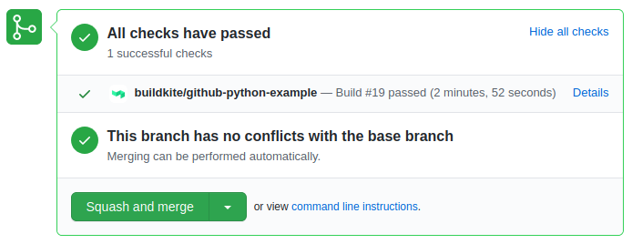
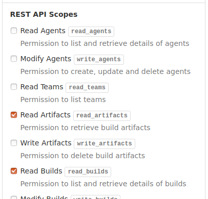

# GitHub Action to download Buildkite Artifacts

This [GitHub Action](https://github.com/actions) downloads artifacts from
a [Buildkite](https://buildkite.com/) pipeline that builds the respective commit.

The action picks up a Buildkite build from the commit status that is set by
[Buildkite integration with Github](https://buildkite.com/docs/integrations/github#connecting-buildkite-and-github),
which looks like this:



After termination of the Buildkite build, the action downloads finished artifacts into your GitHub workflow
where you can use them by other steps.

You can add this action to your GitHub workflow and configure it as follows:

```yaml
- name: Buildkite Artifacts
  uses: EnricoMi/download-buildkite-artifact-action@v1.1
  with:
    github_token: ${{ secrets.GITHUB_TOKEN }}
    buildkite_token: ${{ secrets.BUILDKITE_TOKEN }}
    output_path: artifacts
    log_level: DEBUG
```

**Note:** The action can only be used on `push` events.

The `output_path` and `log_level` variables are optional. Their default values are `.` (current directory) and `INFO`, respectively. The Python logging module defines the [available log levels](https://docs.python.org/3/library/logging.html#logging-levels).

You have to provide a [Buildkite API Access Token](https://buildkite.com/docs/apis/managing-api-tokens) via `buildkite_token` to be stored in your [GitHub secrets](https://docs.github.com/en/actions/configuring-and-managing-workflows/creating-and-storing-encrypted-secrets).
This Buildkite token requires `read_artifacts` and `read_builds` scopes:



Artifacts are stored under the following path: `{output_path}/{artifact_id}/{artifact_path}`

- The `output_path` is a configured above or defaults to the current directory.
- The `artifact_id` avoids conflicts between artifacts that have the same `artifact_path` in different builds.
- The `artifact_path` is the path and filename for the artifact as displayed on the Buildkite build page:


